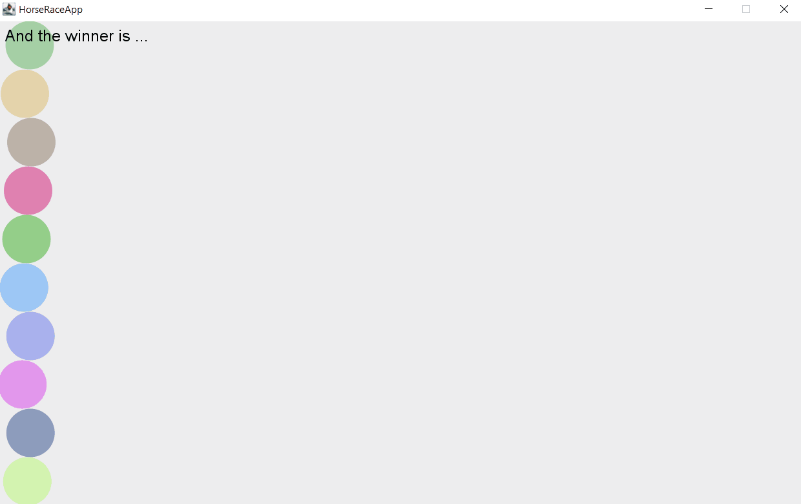

# U33-HorseRace

Im Rahmen dieser Aufgabe implementieren Sie ein Pferderennen.

Es befinden sich 10 Pferde auf der Rennbahn. Die Pferde bewegen sich mit zufälliger Geschwindigkeit Schritt für Schritt vorwärts. Sobald ein Pferd im Ziel ist, soll sein Ranking vom Stadionsprecher bekanntgegeben werden.

Implementieren Sie eine Klasse `Horse`, die jedes Pferd durch einen `Circle` mit zufälliger Farbe darstellt. Jedes Pferd hat eine eindeutige ID und kann gezeichnet und bewegt werden. Es hat das Ziel erreicht, sobald es am rechten Fensterrand angekommen ist.

Die Klasse `StadiumSpeaker` repräsentiert den Stadionsprecher. Dessen Aussagen sollen durch mehrere `Labels` angezeigt werden. Er lauscht dabei auf jedes einzelne der 10 Pferde und wird jedes mal benachrichtigt, wenn eines davon das Ziel erreicht hat. Ob ein Pferd das Ziel erreicht hat, soll über ein `Interface` gelöst werden.

# Zusatzaufgabe

Ergänzen Sie das Projekt um eine Klasse `AnimatedImage` und ersetzen Sie in der Klasse `Horse` die `Circles` durch ein solches animiertes Bild.
In `data/assets` liegen mehrere Bilder. Werden alle Bilder hintereinander abgespielt, sieht es aus, als würde das Pferd tatsächlich Schritte machen.
Sorgen Sie dafür, dass bei jedem Schritt des Pferdes, das jeweils nächste Image aus dem `data/assets`-Ordner gezeichnet wird.

